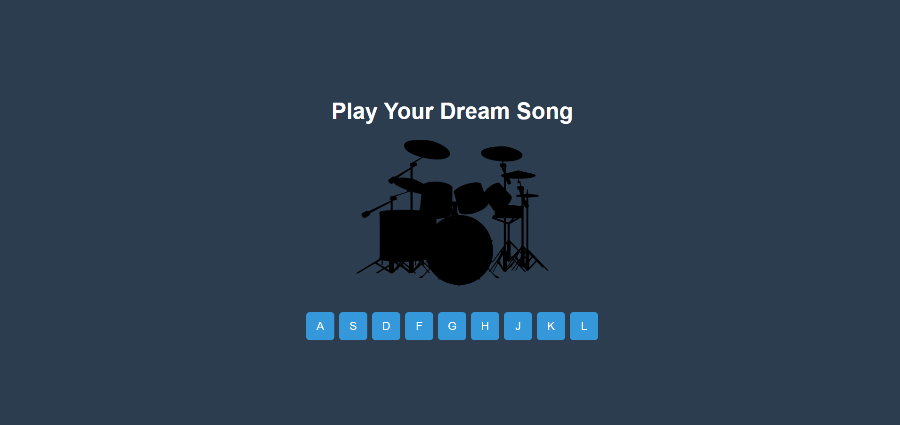

# JS Drum Kit

## Proje Açıklaması

JS Drum Kit, kullanıcının klavye tuşları veya butonlara tıklayarak çeşitli sesleri çalmasını sağlayan basit bir web uygulamasıdır. Uygulama, bir davul seti görüntüsü ile birlikte gelir ve kullanıcılara eğlenceli bir müzik deneyimi sunar.

## Özellikler

- Farklı davul sesleri
- Klavye ve buton etkileşimleri
- Ses çaldığında görsel animasyonlar
